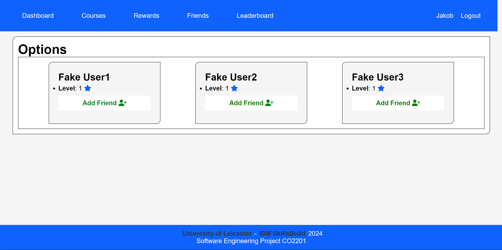
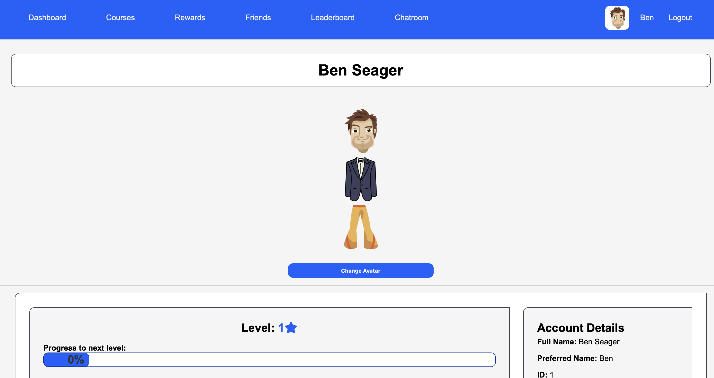

# User Manual
1. [Open webpage](#open-webpage)
1. [Login](#login)
    - [Introduction](#login-introduction)
    - [Registering Account](#registering-account)
    - [Login](#login) 
    - [Reset Passwowrd](#reset-password)
1. [Viewing dashboard](#viewing-dashboard)
    - [Introduction](#introduction)
    - [Current Courses](#current-courses)
    - [Recommended Courses](#recommended-courses)
    - [Completed Courses](#completed-courses)
    - [Top 3 Courses](#top-3-courses)
1. [Starting and finishing course](#starting-and-finishing-course)
1. [Friends](#friends)
    - [Organise Friends](#organise-friends)
    - [Find Friends](#find-friends)
    - [Interacting with Friends](#interacting-with-friends)
1. [Experience System](#experience-system)
1. [Badges](#badges)
8. [Chatroom](#Chatroom)
    - [navigate to chatroom](#navigate-to-chatroom)
    - [sending messages](#sending-messages)
    - [leaving the chatroom](#leaving-the-chatroom)
9. [Avatar Selection](#avatar)

## Open webpage

## Login
### Introduction<a name="login-introduction">
Welcome to the login screen! Using Okta you are able to create/register an account, login to the website and reset your password if you were to ever forget.

### Registering Account<a name="registering-account">

First you will need to create an account so that you are able to login. You will need to provide your email, last name and first name. 

You will then be prompted to enter a password.

Once you have entered all the information you should recieve a confirmation email sent to the one specified during registration. Once you have verified your account by activiating it through the confirmation email, your account will be all set.

### Login<a name="login">

Now that you have created an account, you are able to login. To login into IBM SkillsBuild enter the username (email used in registration) and password you have used during registration.

### Reset Password<a name="reset-password">

If you forget your password, you are able to reset it by clicking "forgot password" within and underneath the login page form. You should then recieve an email sent to the one used during registration, prompting you to change your password.

## Dashboard
### Introduction
Welcome to the IBM SkillsBuild Dashboard! This dashboard provides an overview of your current, recommended, and completed courses. Here's a guide on how to navigate through the dashboard:

### Current Courses
The "Current Courses" section displays the courses you are currently enrolled in. For each course, you can find the following information:
- **Course Name:** The name of the course.
- **Description:** A brief description of the course content.
- **Links:**
  - "IBM SkillsBuild": Direct link to the IBM SkillsBuild platform.
  - "View Course": Detailed information about the course.
  - "Finish Course": Mark the course as completed.

If you have not started any courses, a message will prompt you to start a course from the recommended ones or visit the courses page.

### Recommended Courses
The "Recommended Courses" section suggests new courses based on your profile. Details for each course include:
- **Course Name:** The name of the recommended course.
- **Description:** A brief overview of the course content.
- **Links:**
  - "IBM SkillsBuild": Direct link to the IBM SkillsBuild platform.
  - "View Course": Detailed information about the course.
  - "Start Course": Enroll in the recommended course.

If you have completed all recommended courses, a positive message will congratulate you.

### Completed Courses
The "Completed Courses" section showcases the courses you have successfully finished. For each completed course, you will find:
- **Course Name:** The name of the completed course.
- **Description:** A brief summary of the course content.
- **Links:**
  - "IBM SkillsBuild": Direct link to the IBM SkillsBuild platform.
  - "View Course": Detailed information about the course.
  - "Certificate": Link to your course completion certificate.
  

If no courses have been completed, a message will guide you to start a course from the recommended ones or visit the courses page.

## Top 3 courses

In this section you are able to view the 3 most popular courses. This is based on the number of views each course gets. To get to this section all you need to do is go on to the dashboad and scroll down to the bottom and you will be able to view this section.

## Starting and finishing a course

## Experience System
This part of the program lets you track your progress and see the level your working at.
To view your level start of by click your username at the top right hand corner.

This takes you to your profile page were you will start off at level 1.

To progress on to the next level you need to start a cource.
Go back to your dashboard and select a cource to compete.

upon selecting the cource you will need to complete it,in order to progress.

After the completion of the cource you need to go back to your profile page following the initial steps provided above.

Once you finish the cource you can see you have progressed slightly.
Keep repeting the above steps to move on to the next level.
The more cources you complete the higher you level up.

## Friends

### Organise friends

The friends page allows users to manage their list of friends. They can view pending friend requests and accept or reject them, as well as removing friends.

### Find friends

Users can search for other users to add them as friends. They can type in a username and see if there are any matches.

 If there are no matches or if the search query is invalid, appropriate error messages are displayed.

When a username is searched, the corresponding users are displayed in this grid. Friend requests can be sent or canceled, as well as removing a friend.

### Interacting with friends
- **Friends Leaderboard**: Users can see a leaderboard that displays rankings of their friends based on their level.

- **Friends Profile**: Users can view profiles of their friends, which includes information such as their username, level, current courses and more.

- **Your Profile**: View your friends in your profile, and compare yourself to them!

## Badges

---

## Chatroom
This aspect of our program uses spring boot websockets in order to create a simple chatroom where users can join and send messages to a shared are through the use of STOMP.

### navigate to chatroom <a name="navigate-to-chatroom">
In order to navigate to the chatroom from any from, you will now find it in the header as shown bellow: 

Once the chatroom link has been clicked, a join message will be broadcast to everyone currently in the chatroom as shown bellow.

### sending messages <a name="sending-messages">
To send a message to the chatroom, please input the desired message into the text input field as shown below and either press 'enter' on your keyboard or click the 'send' button to the right of the input field:

Once this is done, your message will appear for all users with the username followed by a timestamp and the message content as shown bellow:

### leaving the chatroom <a name="leaving-the-chatroom">
To leave the chatroom, press any of the links in the navbar to go to another page of the website.
This will broadcast a leave message to the chatroom users which will appear as such: 

---

## Avatar Selection <a name="avatar">

Once you accessed the application dashboard, in the top left you will see a profile avatar next to your username as shown below:

Clicking on your name will take you to the profile page of the application:

From here, you can click on "Change Avatar", which will load the avatar selection screen, where you can cycle through the available Head, Body and Legs categories to create an avatar that suits you:

When you are happy, you can click "Save Avatar" in the bottom left corner of the screen, which will take you back to the profile page, save your avatar, and display it on your profile!

